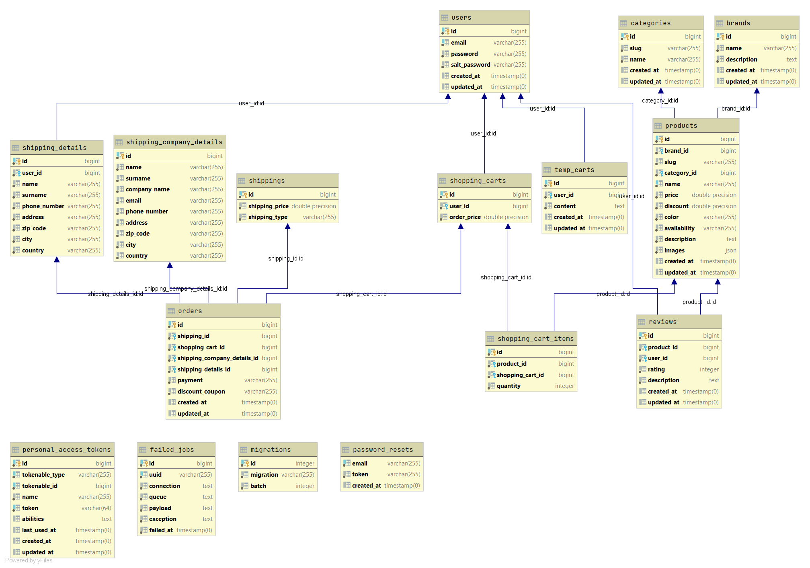

<h1 align=center> HrajMi.sk </h1>
<h4 align=center>Internetový obchod s hudobnými nástrojmi</h4>

### Zadanie
Vytvorte webovú aplikáciu - eshop, ktorá komplexne rieši nižšie definované prípady použitia vo vami zvolenej doméne (napr. elektro, oblečenie, obuv, nábytok). Presný rozsah a konkretizáciu prípadov použitia si dohodnete s Vašim cvičiacim na cvičení.

### Externé knižnice
Základnú šablónu projektu sme nevytvorili my, stiahli sme ju z internetovej stránky <a href="https://themewagon.com/themes/free-bootstrap-4-html5-ecommerece-website-template-shoppers/">ThemeWagon</a>. K danej šablóne boli pripojené aj externé js knižnice, ktoré sme ponechali.

Pre jednoduchšiu prácu s nákupným košíkom sme využili knižnicu <a href="https://github.com/hardevine/LaravelShoppingcart">hardevine/shoppingcart</a>, ktorá nám umožnila pridávanie produktov do košíka a následnú manipuláciu s košíkom pomocou jednoduchých metód ako napríklad Cart::add() alebo Cart::destroy().

Pre potreby projektu sme taktiež nainštalovali knižnicu <a href="http://image.intervention.io/">intervention/image</a>, ktorá nám umožňuje upraviť veľkosť obrázka. Používame ju v administrátorskom prostredí pri nahrávaní obrázkov.

### Implementačné prostredie
K vypracovaniu zadania sme zvolili implementačné prostredie PHP - Laravel rámec. Pre prácu s databázami sme použili PostgreSQL relačný databázový systém.

Pre jednoduchšiu spoluprácu sme použili databázu hostovanú na službe DigitalOcean.com. Údaje do nej sme nahrali pomocou seedrov v Laraveli.

### Fyzický dátový model
 
